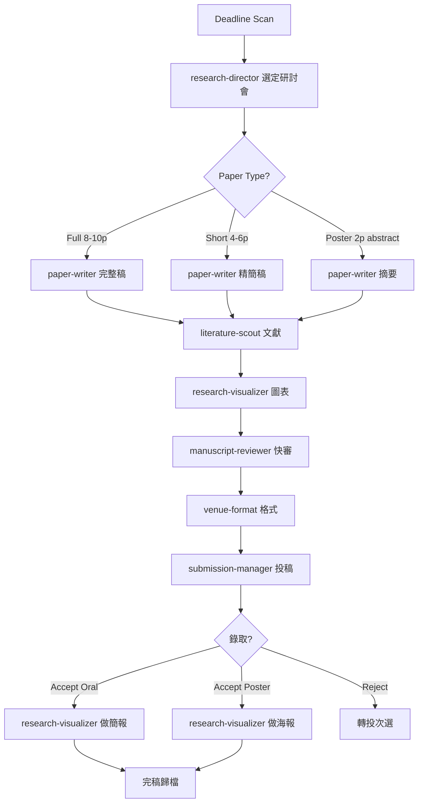

# SOP: 研討會論文流程（Conference Paper）

> 版本: v1.0 | Sprint 4 T6 | 最後更新: 2026-04-11
> 適用對象: academic-research 部門
> 對應模組: feature-spec.md §2.2「研討會流程」

---

## 1. 流程總覽

研討會與期刊最大差異：**截稿硬性 deadline + Short Paper 格式 + 口頭/海報簡報要求**。



---

## 2. Agent 責任分工

| 階段 | 負責 Agent | 呼叫 Skill | 產出物 |
|------|-----------|-----------|--------|
| 研討會掃描 | research-director | venue-format（查表） | `venue-deadlines.md` |
| 類型決策 | research-director | （無） | 決策紀錄 |
| 文獻蒐集 | literature-scout | lit-review, cite-manage | 精簡版 bib（20-30 筆） |
| 初稿 | paper-writer | academic-writing | `conf-draft.md` |
| 圖表 | research-visualizer | schematics | 1-3 張關鍵圖 |
| 內審（快審） | manuscript-reviewer | peer-review | 口頭回饋（≤ 2 天） |
| 格式化 | paper-writer | venue-format | `{venue}-final.pdf` |
| 投稿 | submission-manager | （無） | 投稿紀錄 |
| 簡報/海報 | research-visualizer | research-slides / research-poster | `slides.pdf` / `poster.pdf` |

---

## 3. 決策判斷樹

### 3.1 研討會類型選擇（依 3 主軸）

| 研究主軸 | 首選研討會 | 備選 |
|---------|-----------|------|
| **金融科技** | ACM ICAIF / IEEE CIFEr / ICDM / CIKM | ICCMB / IOP Conf |
| **教育科技** | ICAIE / ICIET / AIED | SITE / CSCL |
| **AI 跨領域方法** | ECML-PKDD / IJCAI | ICDM（應用組） |

> 優先參考 `scholar-profile.md`「發表紀錄」與 `venue-list.md`「已投過的 venue」— 主持人有歷史的會議錄取率較高。

### 3.2 Paper Type 決策

```
研究成熟度？
├─ 初步 idea + 少量實驗 → Short Paper / Poster
├─ 完整方法 + baseline 比較 → Full Paper
└─ 大規模實證 + 可重現 → Full Paper（並考慮同時投期刊）
```

### 3.3 Deadline 風險控制

| 距 Deadline | 行動 |
|-------------|------|
| > 60 天 | 正常流程 |
| 30-60 天 | 啟動並行：literature-scout + paper-writer 同時動 |
| 14-30 天 | 縮減文獻到 15 筆、砍次要實驗、快審僅 1 輪 |
| < 14 天 | research-director 決策是否放棄 → 轉投下一場 |
| < 7 天 | 不新增投稿，僅處理既有稿件 |

---

## 4. Fallback 處理

| 失敗情境 | Fallback 動作 |
|---------|--------------|
| 截稿前內審未完成 | paper-writer 自審（以 peer-review Skill checklist 自檢），研討會稿可接受較低完整度 |
| 圖表生成失敗 | 改用簡化版折線圖/柱狀圖；海報可用純文字表格代替 |
| 投稿系統 EasyChair/CMT 帳號問題 | submission-manager 提前 48 小時註冊，不得拖到最後一天 |
| 錄取為 Poster 但預期是 Oral | 接受降級；research-visualizer 依海報規格重製（poster ≠ slides 壓縮） |
| 全 Reject | 1. 轉投同主軸備選研討會 → 2. 若下一場 deadline 已過，改投期刊 Short Communication |
| 論文與既有主持人發表（如 ICAIE 2025 ×2）題材重疊 | 必須明確區分「延伸點」與「新貢獻」，在 Intro 加入區隔段落 |

---

## 5. 範例段落（跨三主軸）

### 5.1 教育軸範例（T10 對應）

```yaml
場景: "ICAIE 2026 — ChatGPT 在資訊教育的延伸研究"
流程實例:
  立案:
    Agent: research-director
    延伸基礎: 主持人 ICAIE 2025 ×2 + ICIET 2025
    新題目: "ChatGPT 輔助學習對不同先備知識學生的分眾效應"
  文獻:
    必引（自引）: #1, #2, #3（ICAIE/ICIET 三篇）
    外部: Kasneci 2023, Long & Magerko 2020
  Paper Type: Short Paper（6 頁）— 以初步實證為主
  實驗: 東吳資科系學生 120 人，分高/中/低先備組
  預期: 顯示分眾交互效應 → 錄取後升級為 ICAIE 2026 Oral
```

### 5.2 金融軸範例

```yaml
場景: "ACM ICAIF 2026 — LLM 金融文本情感嵌入初步實證"
流程實例:
  立案:
    Agent: research-director
    理由: "ICAIF 是金融 AI 頂級研討會，T4 壓測證實題材可行"
  Paper Type: Full Paper（10 頁）
  關鍵圖: Cross-Attention 融合架構圖（research-visualizer 使用 schematics Skill）
  內審關注: 自引 #5 IJDMMM 的連貫性必須明確
  Fallback: 若 ICAIF reject → 轉投 IEEE CIFEr 或 ICCMB
```

### 5.3 AI 跨領域軸範例（T11 對應）

```yaml
場景: "ECML-PKDD 2026 — 跨金融與教育的文本可解釋性方法"
流程實例:
  立案:
    Agent: research-director
    理由: "金融文本（財報）與教育文本（學生回饋）共用一套 XAI 方法"
  Paper Type: Full Paper
  重點: 方法本身，金融/教育為應用場景（次要）
  Venue 備選: IJCAI Applied Track / ICDM Workshop
```

---

## 6. 與其他 SOP 的關聯

- 期刊流程 → `sop-journal.md`（研討會可做為期刊前哨）
- Venue 決策 → `venue-list.md`
- 主持人發表紀錄 → `scholar-profile.md`

---

**確認**: [x] paper-writer / [x] research-visualizer / [x] research-director
