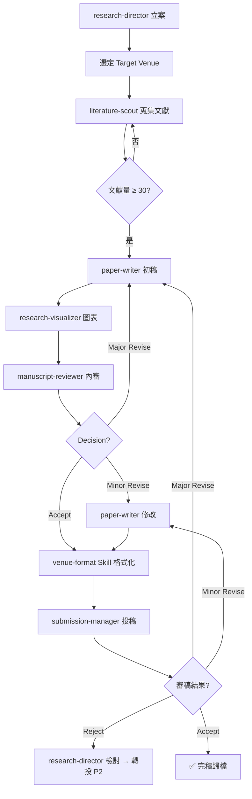

# SOP: 期刊投稿流程（Journal Submission）

> 版本: v1.0 | Sprint 4 T6 | 最後更新: 2026-04-11
> 適用對象: academic-research 部門
> 對應模組: feature-spec.md §2.1「期刊投稿流程」

---

## 1. 流程總覽

```
[立案] → [文獻探討] → [初稿撰寫] → [內審] → [格式化] → [投稿] → [審稿回應] → [接受/拒稿]
```

### Mermaid 流程圖



---

## 2. Agent 責任分工

| 階段 | 負責 Agent | 呼叫 Skill | 產出物 |
|------|-----------|-----------|--------|
| 立案 | research-director | （無） | `.outputs/papers/{id}/proposal.md` |
| Venue 選擇 | research-director | venue-format（查表） | venue 決策紀錄 |
| 文獻蒐集 | literature-scout | lit-review, cite-manage | `references.bib` + `literature-map.md` |
| 初稿撰寫 | paper-writer | academic-writing | `draft-v1.md`（IMRAD 完整結構） |
| 統計/實驗 | paper-writer | stat-analysis | `experiments/results.md` |
| 圖表製作 | research-visualizer | schematics | `figures/` 資料夾 |
| 內審 | manuscript-reviewer | peer-review, critical-thinking | `internal-review.md` |
| 格式化 | paper-writer | venue-format | `final-{venue}.md` |
| 投稿 | submission-manager | （無） | `submission-log.md` |
| 審稿回應 | paper-writer | academic-writing | `response-to-reviewers.md` |

> ⚠️ **審稿中立性規則**：manuscript-reviewer 執行「內審自家稿件」時，**可**讀 scholar-profile.md（確認自引規則有遵守）；但執行 T11 型外部審稿時**不得**讀。

---

## 3. 決策判斷樹

### 3.1 Target Venue 選擇（依 3 主軸）

```
研究主題？
├─ 金融科技 → P1: C&E:AI / IJDMMM / JBF / ESWA
├─ 教育科技（含 AI 輔助學習）→ P1: C&E:AI / Computers & Education
├─ AI 跨領域方法學（偏理論）→ P1: IEEE TPAMI / Information Sciences
└─ 不確定 → 詢問 research-director，對照 scholar-profile.md「研究主軸」節點
```

### 3.2 內審結果後的分支

| 內審結論 | 處理方式 |
|---------|---------|
| **Accept** | 直接進入格式化 |
| **Minor Revise**（≤ 10 處修改）| paper-writer 修改後免再審，直接送格式化 |
| **Major Revise**（主題調整 / 結構改寫）| 退回「初稿撰寫」階段，重走內審 |
| **Reject**（根本性問題）| 升級至 research-director 重新評估 venue |

### 3.3 期刊回覆後的分支

| 期刊決策 | 動作 |
|---------|------|
| Accept / Minor | paper-writer 直接改，14 天內回覆 |
| Major Revise | 重走「初稿 → 內審 → 格式化」子流程 |
| Reject | 1. 先看評審意見是否具建設性 → 2. research-director 決定是否轉投 P2 venue |
| Desk Reject | 立即檢討 scope 是否對錯 venue，轉投 |

---

## 4. Fallback 處理

| 失敗情境 | Fallback 動作 |
|---------|--------------|
| literature-scout 找不到足夠文獻（< 20 筆）| 1. 擴展關鍵字至同義詞 → 2. 降低年份門檻（從 5 年放寬到 10 年）→ 3. 仍不足則 research-director 重新評估題目可行性 |
| cite-manage DOI 驗證失敗 | 1. 改用 Semantic Scholar API 交叉驗證 → 2. 手動從出版社網站取 → 3. 仍失敗則標記 `[UNVERIFIED]` 並通知 research-director |
| stat-analysis 結果與假設相反 | 不得竄改數據。paper-writer 需改寫 Discussion 說明為何與預期不符，或 research-director 重設研究問題 |
| manuscript-reviewer 判定「方法論根本錯誤」| 退回立案階段，literature-scout 補強基礎理論文獻 |
| venue-format 與期刊模板不符 | 以期刊官網最新 LaTeX / Word 模板為準，Skill 資料為輔 |
| 投稿系統上傳失敗 | submission-manager 截圖 + 聯繫 editorial office，保留投稿郵件作為 timestamp 證據 |

---

## 5. 金融科技範例段落

### 場景：主持人將「LLM 金融風險評估」投稿 Expert Systems with Applications (ESWA, SCI Q1)

```yaml
流程實例:
  立案:
    Agent: research-director
    決策: "金融主軸 × 主持人前期成果 #5（IJDMMM 長文本→圖像）延伸"
    Venue: ESWA (P1 金融軸首選)
    理由: "ESWA 審稿偏好實證 + 方法創新，與本研究 LLM 情感嵌入 × 雙模態融合契合"

  文獻蒐集:
    Agent: literature-scout
    關鍵字組合:
      - "LLM" AND "financial risk" AND "sentiment"
      - "FinBERT" OR "BloombergGPT"
      - "multimodal fusion" AND "finance"
    必引文獻:
      - 自引 #4, #5, #6（主持人前期成果）
      - FinBERT (Araci 2019), BloombergGPT (Wu 2023)
      - Loughran-McDonald 2011（金融情感詞典開山）
    產出: 45 筆文獻，自引比例 7%（符合 5-15% 規範）

  初稿撰寫:
    Agent: paper-writer
    結構:
      Introduction: 點出 LLM 在金融風險領域的 gap
      Related Work: 分三主題（LLM 金融文本 / 雙模態融合 / 台灣實證）
      Methodology: Late Fusion vs Cross-Attention vs Gating Network 對照
      Experiments: 2015-2024 台灣上市公司 5,000 筆
      Results: 相對 XGBoost baseline AUC 提升 8.3%
      Discussion: 可解釋性（SHAP / Attention Visualization）

  內審:
    Agent: manuscript-reviewer
    關注點:
      - 自引 #5 是否自然引入（避免突兀）
      - 實驗設計是否有 train/val/test 時序切分防資料洩漏
      - ESWA 偏好的可重現性：程式碼與資料是否可公開

  格式化:
    Skill: venue-format
    模板: ESWA LaTeX (elsarticle)
    關鍵檢查: 字數 ≤ 12,000 / 參考文獻 ≤ 60 / 圖表 ≤ 10
```

---

## 6. 與其他 SOP 的關聯

- 研討會流程 → `sop-conference.md`（可做為期刊前哨，先投研討會取得初步反饋）
- 審稿流程 → `sop-peer-review.md`（manuscript-reviewer 內審時參考審稿 SOP）
- Venue 選擇規則 → `venue-list.md`

---

**確認**: [x] paper-writer / [x] research-director
