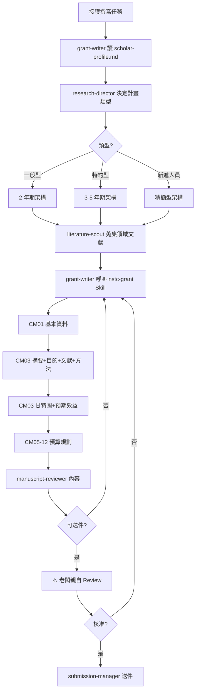

# SOP: 國科會計畫撰寫流程（NSTC Grant Proposal）

> 版本: v1.0 | Sprint 4 T6 | 最後更新: 2026-04-11
> 適用對象: academic-research 部門（grant-writer 專屬）
> 對應模組: feature-spec.md §2.4「國科會計畫流程」
> 相關 Skill: **nstc-grant**（僅 grant-writer 可呼叫）

---

## ⚠️ 前置要求

1. grant-writer 必讀：`scholar-profile.md` 完整檔案
2. 本 SOP 所有產出物存於 `.outputs/grants/{project-id}/`（受 `.gitignore` 保護）
3. 參考底稿：國科會計畫書 115WFD0310041（主持人 2026 年在跑的計畫）
4. 壓測報告：`.outputs/grants/nstc-fintech-stress-test/evaluation.md`（T4 產出，證明 Skill 領域通用）

---

## 1. 流程總覽



---

## 2. Agent 責任分工

| 階段 | 負責 Agent | 呼叫 Skill | 產出物 |
|------|-----------|-----------|--------|
| 計畫類型決策 | research-director | （無） | 決策紀錄 |
| scholar 資訊 | grant-writer | （讀檔） | 主持人能力點摘要 |
| 文獻蒐集 | literature-scout | lit-review, cite-manage | `references.bib`（需含自引） |
| CM01-CM03 撰寫 | grant-writer | **nstc-grant** | `cm01-03.md` |
| 預算規劃 CM05-CM12 | grant-writer | **nstc-grant** | `cm05-12.md` |
| 甘特圖 | research-visualizer | schematics | `gantt.png` |
| 預算估算 | grant-writer | **nstc-grant** | `budget.xlsx` |
| 內審 | manuscript-reviewer | critical-thinking, peer-review | `internal-review.md` |
| **最終 Review** | **老闆（人工）** | **（無）** | **Review 決策書** |
| 送件 | submission-manager | （無） | 送件紀錄 |

> 🔴 **核心強制規則**：`nstc-grant` Skill **僅 grant-writer 可呼叫**。其他 Agent 呼叫即 Blocker。

---

## 3. 決策判斷樹

### 3.1 計畫類型選擇

```
主持人資歷？
├─ 新進人員（獲博士 ≤ 3 年）→ 新進人員研究計畫
├─ 助理教授 / 副教授 → 一般型研究計畫（預設）
├─ 有重大產業合作潛力 → 一般型 + 產學合作條款
└─ 連續承接計畫達 3 期 → 可考慮特約研究計畫
```

主持人（邱嘉豪助理教授）→ **一般型研究計畫**

### 3.2 主學門代碼（3 主軸對應）

| 研究主軸 | 主學門 | 副學門 | 備註 |
|---------|--------|--------|------|
| 純金融 AI（風險評估、資產定價）| EC（財務金融）| CS | 主持人在東吳資科系，此組合可行 |
| 純 AI 方法（模型架構）應用於金融 | CS | EC | 偏方法論貢獻 |
| 資訊教育（AI 輔助學習）| HSS03-6（資訊教育）| CS | 對應主持人 ICAIE/ICIET 發表 |
| AI 跨領域方法 | CS | 依應用主題 | |

> ⚠️ **主學門選錯會遇到不熟該領域的審查者** — 見壓測報告補強點 2。

### 3.3 IRB 勾選決策

```
研究對象類型？
├─ 人體生理/心理資料 → 需 IRB
├─ 學生行為（教室觀察/問卷）→ 需 IRB + 家長同意書
├─ 教師訪談 → 需 IRB
├─ 上市公司公開財報/法說會 → 不需 IRB ✅
├─ 網路公開爬蟲資料 → 不需 IRB（但需資料倫理說明）
└─ 不確定 → research-director + 學校 IRB 辦公室確認
```

### 3.4 文獻自引比例

依 scholar-profile.md 規則：
- 金融題材 → 必引 #4, #5, #6（IOP / IJDMMM / ICCMB）
- 教育題材 → 必引 #1, #2, #3（ICAIE ×2 / ICIET）
- AI 跨領域 → 依具體應用領域決定
- **自引比例目標**：5-15%（太少失去「主持人能力」加分，太多失學術中立）

---

## 4. Fallback 處理

| 失敗情境 | Fallback 動作 |
|---------|--------------|
| grant-writer 無法取得主持人過去計畫書原稿 | 參考國科會計畫書範本 + 本 Skill 內建結構 |
| 甘特圖任務過密無法在 30 頁內呈現 | research-visualizer 改用階段彙整圖，細節移到附錄 |
| 預算超過學門上限 | 依優先順序砍：差旅 > 耗材 > 設備 > 人力 |
| CM03 寫超 30 頁限制 | 優先砍文獻探討（保留 3-5 主題），次砍預期效益細節 |
| 主持人研究對象跨領域無對應學門 | research-director 決定主學門（選「大家都熟」優於「最精準」）|
| 文獻中繁中資源過少 | 補充台灣在地案例段落，不強求繁中文獻比例 |
| 老闆 Review 退件 | grant-writer 記錄退件原因 → 重新撰寫對應章節 → 再送審 |
| 送件前 48 小時發現嚴重問題 | 立即通知 research-director + 老闆，評估是否延期或放棄 |

---

## 5. 金融科技範例段落（T12 對應，對齊 T4 壓測）

### 5.1 計畫基本資訊

```yaml
計畫中文名稱: "以大型語言模型整合金融文本情感與數值特徵之企業風險評估框架研究（1/2）"
計畫類型: 一般型研究計畫
執行期限: 2026/08/01 - 2028/07/31（2 年期）
主學門: EC（財務金融）
副學門: CS（電腦科學，NLP / LLM）
IRB: 否（研究對象為上市公司公開財報與法說會）
```

### 5.2 CM03 §1-3 研究目的（必引自引 #5）

```markdown
本研究延續主持人 2021 年發表於 IJDMMM 之「長文本轉圖像」技術
（Chiu, Tsai, & Chen, 2021, 13(3), 211-230），進一步擴展至 LLM 時代
的金融文本量化處理。具體研究目的如下：

1. 建構「LLM 金融文本情感量化指標」...
2. 驗證「文本與數值雙模態融合模型」有效性...
3. 評估該框架於台灣上市公司的實證效能...
```

### 5.3 CM08 耗材費（補強金融資料庫費）

```
| 項目                          | 說明                      | 預算      |
|------------------------------|--------------------------|-----------|
| TEJ 台灣經濟新報資料庫        | 台股財報 + 法說會         | 60,000    |
| OpenAI API 費                 | LLM 嵌入提取              | 80,000    |
| GPU 雲端運算                  | 模型訓練與推論            | 100,000   |
| 學術資料處理雜支              | 論文 APC + 購書等         | 30,000    |
```

### 5.4 CM12 國外差旅費（研討會對應）

```
- ACM ICAIF 2027（美國）：NT$ 80,000
- IEEE CIFEr 2027（歐洲）：NT$ 95,000
```

---

## 6. 教育範例段落（備用，若主持人轉投教育學門）

```yaml
計畫名稱: "ChatGPT 輔助資訊教育對不同先備知識學生的分眾效應研究"
主學門: HSS03-6（資訊教育）
副學門: CS
IRB: 是（東吳大學教學倫理委員會）
必引自引: #1 ICAIE 2025 / #2 ICAIE 2025 / #3 ICIET 2025
預算重點: 學生問卷費 / 統計軟體授權 / 教育研討會差旅（ICAIE/ICIET）
```

---

## 7. 與其他 SOP 的關聯

- 期刊流程 → `sop-journal.md`（計畫執行產出之期刊論文）
- 主持人識別 → `scholar-profile.md`（必讀前置）
- 領域通用性驗證 → `.outputs/grants/nstc-fintech-stress-test/evaluation.md`

---

## 8. 關鍵檢查清單（送件前必跑）

- [ ] 主持人姓名/職稱/機構正確
- [ ] 主學門代碼對題材
- [ ] 中摘 ≤ 500 字、英摘 ≤ 500 字
- [ ] 研究目的 ≤ 3 條，動詞開頭
- [ ] 文獻探討 3-5 主題節，每節結尾點 gap
- [ ] 自引比例 5-15%
- [ ] 甘特圖任務切分明確
- [ ] 預算不超過學門上限
- [ ] 30 頁內
- [ ] IRB 勾選正確
- [ ] CM12 差旅對應預期發表 venue
- [ ] **老闆最終 Review 通過**（Sprint 4 T12 硬性要求）

---

**確認**: [x] grant-writer / [x] research-director / [ ] 老闆（人工最終核可）
