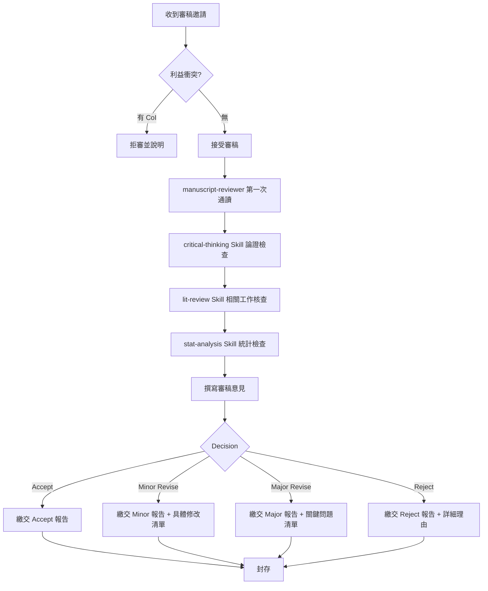

# SOP: 論文審稿流程（Peer Review）

> 版本: v1.0 | Sprint 4 T6 | 最後更新: 2026-04-11
> 適用對象: academic-research 部門（manuscript-reviewer 主責）
> 對應模組: feature-spec.md §2.3「審稿流程」

---

## ⚠️ 最重要規則：中立性原則

> **審稿外部論文時，manuscript-reviewer 不得讀取 `scholar-profile.md`。**
> 目的：避免將主持人的研究偏好投射到他人稿件上，造成審稿偏見。
>
> **例外**：若是審自家部門投稿前的內審（對齊 sop-journal.md §2 的「內審」階段），**可以**讀 scholar-profile.md 檢查自引規範是否遵守。

---

## 1. 流程總覽



---

## 2. Agent 責任分工

| 階段 | 負責 Agent | 呼叫 Skill | 產出物 |
|------|-----------|-----------|--------|
| CoI 檢查 | research-director | （無） | CoI 確認書 |
| 第一次通讀 | manuscript-reviewer | （無） | 概覽筆記 |
| 論證檢查 | manuscript-reviewer | critical-thinking | 論證缺陷清單 |
| 文獻核查 | manuscript-reviewer | lit-review | 漏引/錯引清單 |
| 統計檢查 | manuscript-reviewer | stat-analysis | 統計問題清單 |
| 方法可重現性 | manuscript-reviewer | peer-review | 重現性檢核表 |
| 最終報告 | manuscript-reviewer | academic-writing | `review-report.md` |

> ⚠️ 審稿報告存於 `.outputs/reviews/{venue}/{paper-id}/`（受 `.gitignore` 保護不進 git）。

---

## 3. 決策判斷樹

### 3.1 利益衝突（Conflict of Interest）檢查

```
是否有以下情況？
├─ 作者為主持人近 3 年共同作者 → CoI，拒審
├─ 作者為主持人指導/被指導學生 → CoI，拒審
├─ 作者為主持人所屬機構同事 → CoI，拒審
├─ 研究題目與主持人當前計畫有競爭關係 → CoI，拒審
└─ 以上皆無 → 可審
```

### 3.2 審稿結論分支

| 面向 | Accept 條件 | Minor | Major | Reject |
|------|-----------|-------|-------|--------|
| **研究問題重要性** | 明確且重要 | 明確 | 不夠清楚 | 瑣碎或已解決 |
| **方法論** | 正確且創新 | 正確但非新 | 有小錯誤 | 根本錯誤 |
| **實驗/證據** | 充分 | 稍弱可補 | 顯著不足 | 無法支持結論 |
| **寫作品質** | 清晰 | 小瑕疵 | 需大幅改寫 | 難以理解 |
| **自引合理性** | ≤ 15% 且自然 | 稍多但合理 | 過多或牽強 | 顯著學術不端 |

**決策規則**：
- 所有面向皆 Accept → **Accept**
- 至多 2 個 Minor → **Minor Revise**
- 有 1 個以上 Major → **Major Revise**
- 有任一 Reject → **Reject**

### 3.3 審稿意見的嚴格度

```
研討會 Short Paper → 容忍度較高，Minor 為主
期刊 SCI Q1 → 嚴格，所有面向需達標
期刊 SCI Q2-Q3 → 中等，核心方法需正確
國科會計畫書（若有擔任初審）→ 看計畫類型（一般型 vs 特約型）
```

---

## 4. Fallback 處理

| 失敗情境 | Fallback 動作 |
|---------|--------------|
| 稿件主題超出 reviewer 專業範圍 | 立即回報 editor 請求換 reviewer 或請求 co-review |
| 作者引用了你讀不到的論文（非開放存取） | 標註「無法取得原文驗證」，以公開摘要為依據給意見 |
| 統計方法超出 manuscript-reviewer 理解（如進階貝氏模型）| 在報告中明確註記「建議由統計專家複審此部分」|
| 疑似 AI 生成 / 抄襲 | 立即停止審稿 → 回報 editor，不自行指控 |
| 審稿期限緊迫 | 優先檢查：1) 研究問題 2) 方法正確性 3) 實驗設計 4) 自引規範 5) 寫作品質（順序不可顛倒）|
| manuscript-reviewer 發現與主持人研究方向相似 | 立即啟動 CoI 檢查，若發現潛在競爭 → 拒審 |

---

## 5. 範例段落

### 5.1 AI 跨領域論文審稿範例（T11 對應）

```yaml
場景: "審稿 ECML-PKDD 2026 投稿論文 —— 《Cross-Domain XAI via Attention Distillation》"
Paper 主題: 一套注意力蒸餾方法，應用於金融與醫療兩個領域
CoI 檢查:
  - 作者機構: UCLA（與主持人無關聯）
  - 題材: 方法論創新，與主持人 IJDMMM #5 不構成競爭
  - 結論: 可審

第一次通讀 (manuscript-reviewer, 不讀 scholar-profile.md):
  - 摘要清晰，Intro 有明確 gap
  - Method 圖示不夠清楚（第 4 節 Figure 2 看不出 teacher-student 關係）

critical-thinking 論證檢查:
  - 主張：「attention distillation 比 logit distillation 保留更多可解釋性」
  - 證據：只在 2 個領域測試 → 結論過強
  - 建議：Minor Revise — 加實驗或弱化 claim

lit-review 核查:
  - 漏引 Hinton 2015 (KD 開山) × 必補
  - 漏引 2023-2024 XAI 最新進展 × 必補
  - 未發現作者自引過多問題

stat-analysis:
  - 重複實驗 3 次，std 有報 ✅
  - 但無顯著性檢定 ⚠️
  - 建議補 paired t-test

最終決策: Major Revise
理由:
  1. Claim 強度與證據不對稱
  2. 缺統計顯著性檢定
  3. 相關工作需補強
  4. Figure 2 需重繪
報告字數: 約 1200 字
```

### 5.2 金融論文審稿範例

```yaml
場景: "審稿 Expert Systems with Applications — LLM 情感金融預測投稿"
CoI 檢查: 主題與主持人 T4 壓測接近 → 啟動 CoI 審查
結論: 若作者為競爭團隊 → 拒審；若為不同方法學路徑（如純 RL）→ 可審
原則: 寧可拒審不可失中立
```

---

## 6. 與其他 SOP 的關聯

- 期刊流程內審 → `sop-journal.md` §2（僅該情境可讀 scholar-profile）
- 研討會流程內審 → `sop-conference.md` §2（同上）
- 審稿中立性原則 → `agent-prompts.md` manuscript-reviewer 章節

---

**確認**: [x] manuscript-reviewer / [x] research-director
